# ElectroPi

ElectroPi is a Flutter-based project management application developed as part of an assessment.

The application allows users to authenticate, manage projects and tasks, update profiles, and interact with data through API integration while providing a responsive and smooth user experience.

---

## Features

* User Login & Registration
* Form Validation
* API Integration using Dio
* Error Handling & Loading States
* Project Listing
* Project Search
* Task Management
* Profile Update
* Local Storage using SharedPreferences
* Dark Mode Support
* Responsive UI
* State Management using BLoC
* Smooth Screen Transitions & Animations
* Unit Testing
* Widget Testing

---


# Screenshots

## Splash Screen

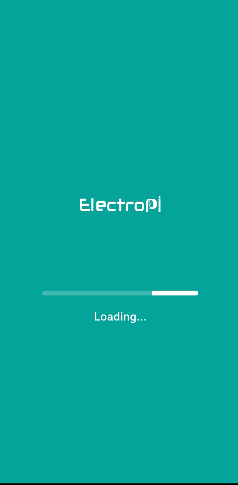

---

## Onboarding Screens


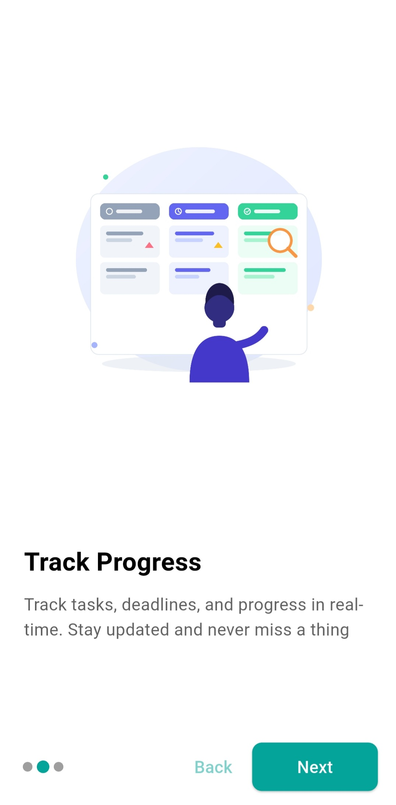


---

## Login Screen

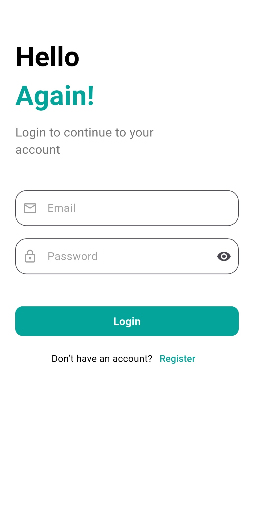

---

## Register Screen

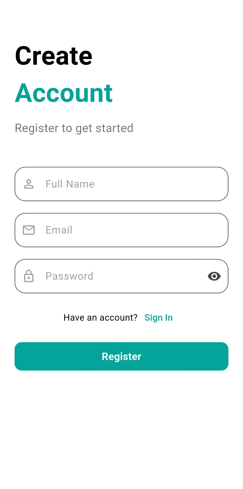

---

## Projects Screen

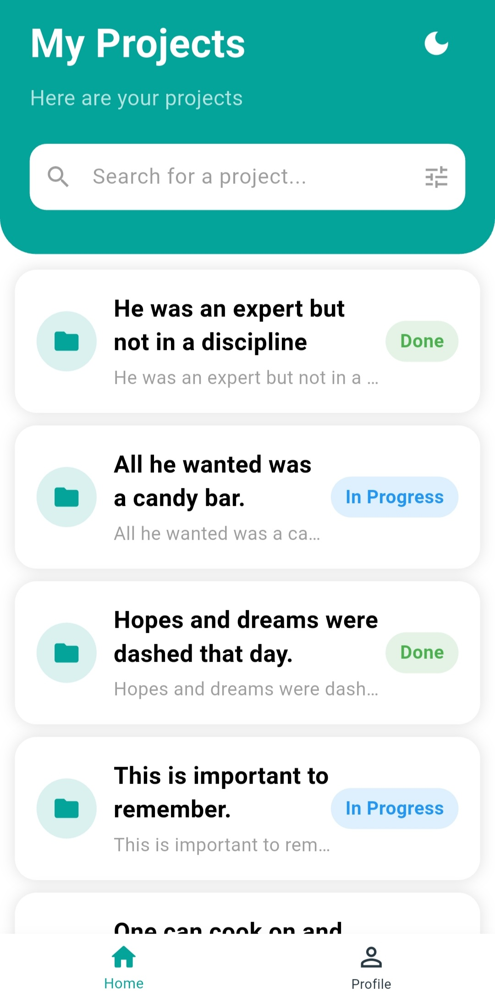

---

## Search

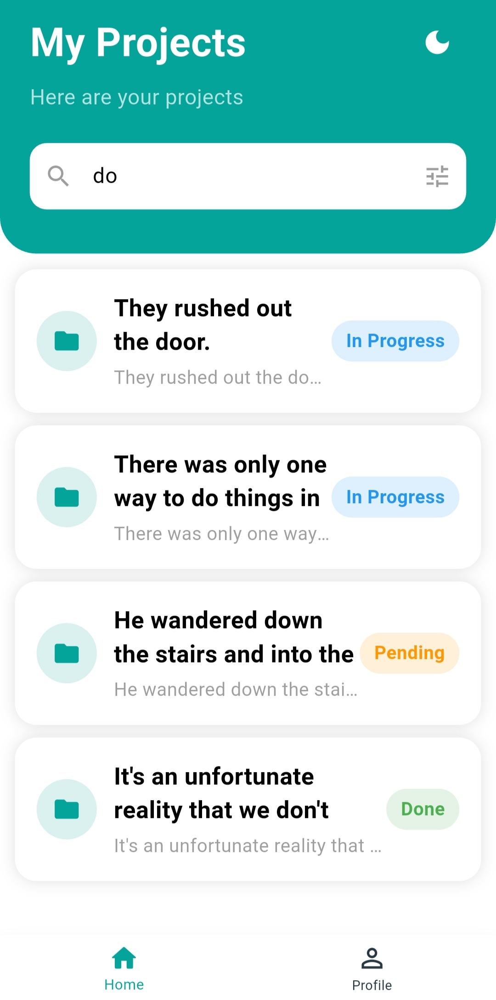

---

## Tasks Details Screen

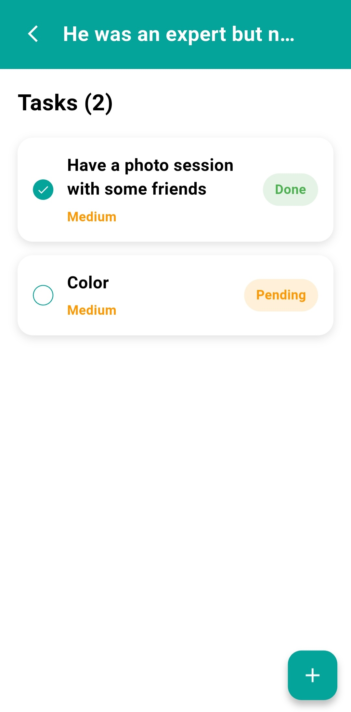

---

## Add Task

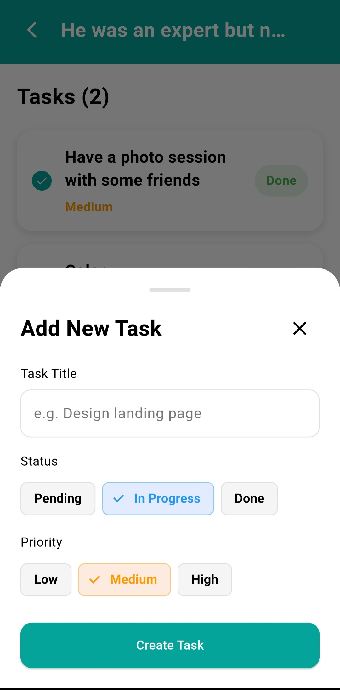

---

## Profile Screen

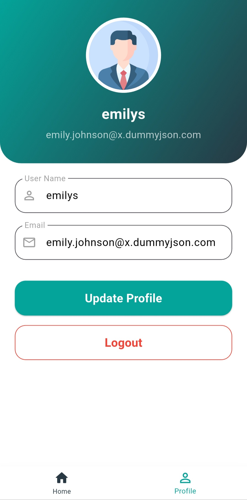

---

## Dark Mode — Login

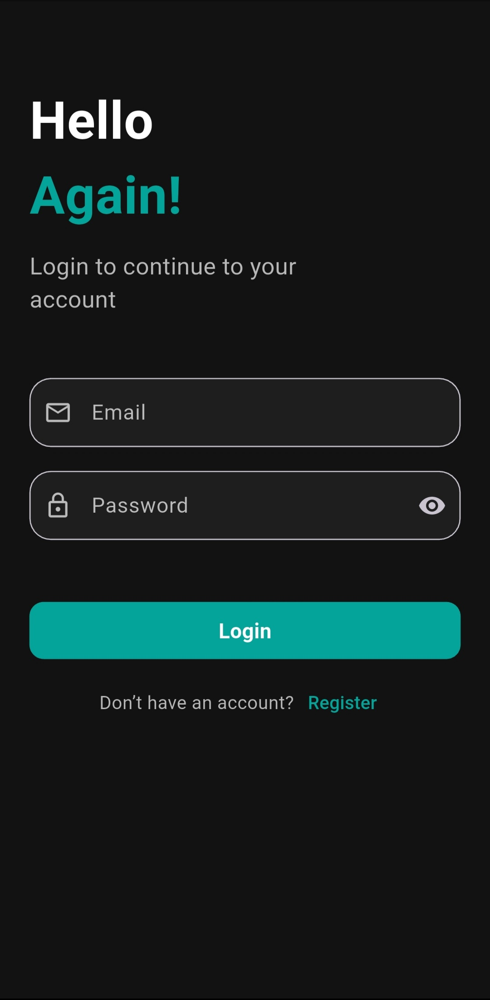

---

## Dark Mode — Register

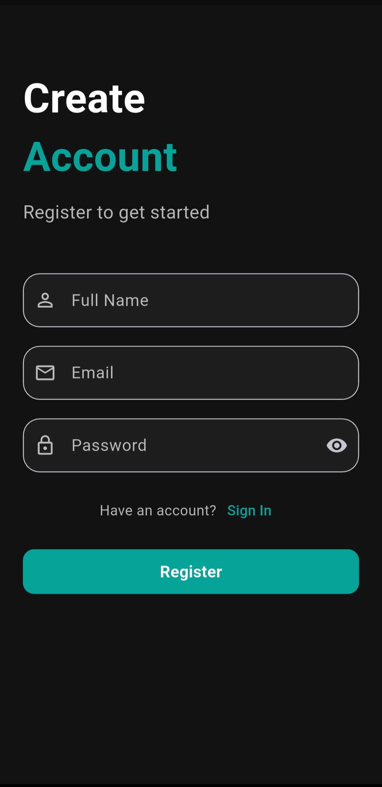

---

## Dark Mode — Projects

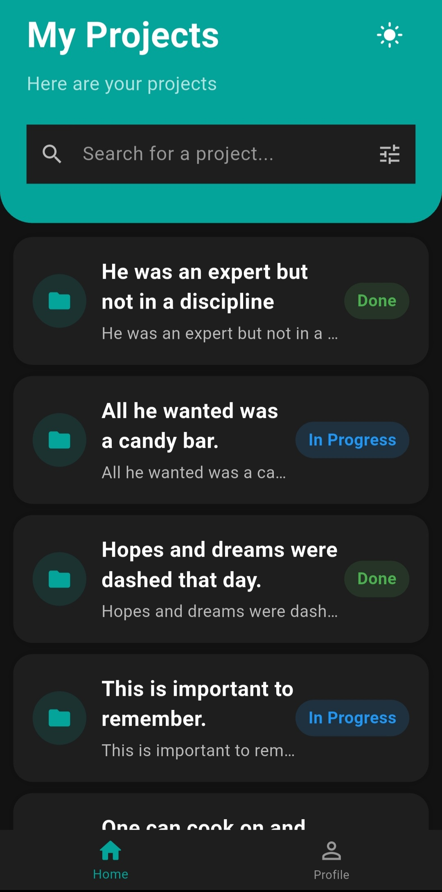

---

## Dark Mode — Tasks

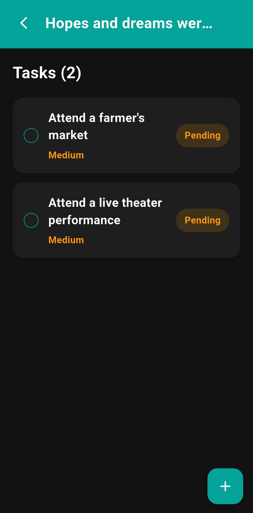

---

## Dark Mode — Add Task

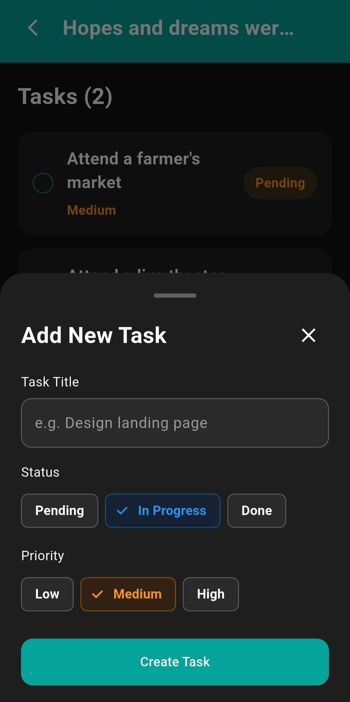

---

## Dark Mode — Profile

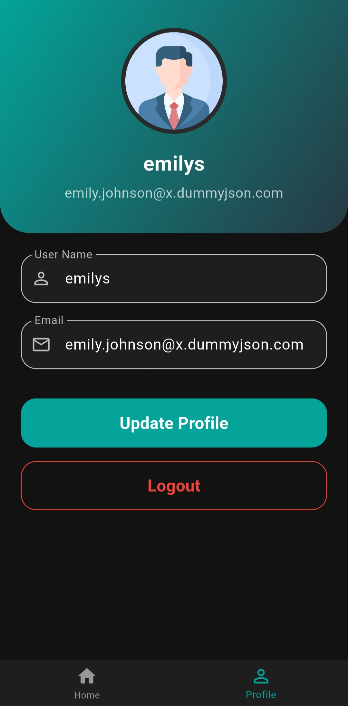

---

# Getting Started

### Prerequisites

Make sure you have installed:

* Flutter SDK
* Dart SDK
* Android Studio / VS Code
* Emulator or Physical Device

Check installation:

```bash
flutter doctor
```

---

## Installation

Clone repository:

```bash
git clone https://github.com/MahmoudTareek/ElectroPi.git
```

Move to project:

```bash
cd ElectroPi
```

Install packages:

```bash
flutter pub get
```

Run application:

```bash
flutter run
```

---

## Dependencies

```yaml
flutter_bloc
dio
shared_preferences
fluttertoast
smooth_page_indicator
webview_flutter
conditional_builder_null_safety
```

---

## Project Structure

```plaintext
lib
│
├── cubit/
├── models/
├── modules/
├── shared/
├── layout/
└── main.dart
```

---

## Download 
<a href="https://github.com/MahmoudTareek/ElectroPi/releases/latest"></a>

---

## Built With

* Flutter
* Dart
* BLoC
* Dio
* SharedPreferences

---
